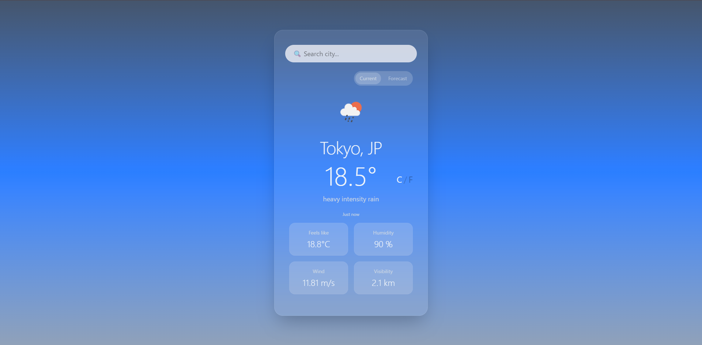
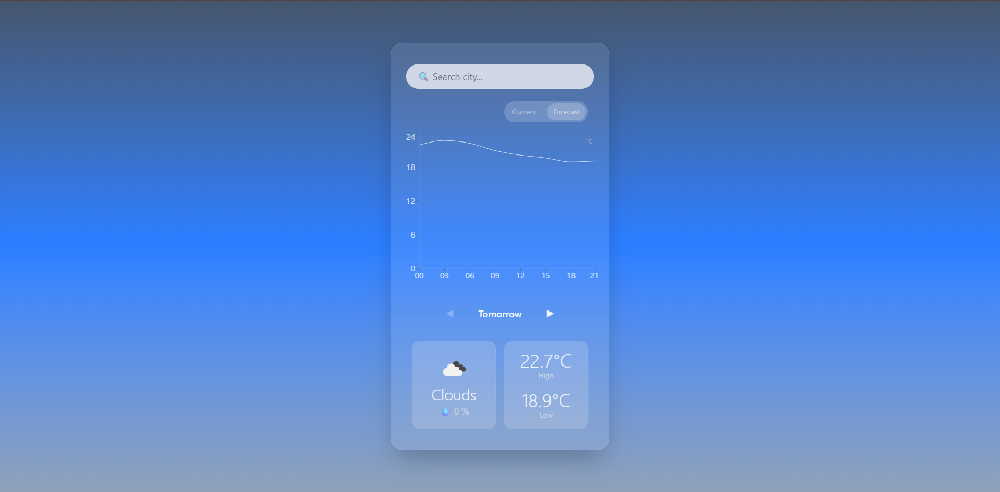

# 🌦 Weather Dashboard

> 💡 **Engineering Focus**: This is NOT just another tutorial weather app. It is a production-ready frontend architecture exercise focused on **strict decoupling, state isolation, data normalization, and network performance optimization**.

🔗 Live Demo: 
https://jillchiu.github.io/react-weather-dashboard/

📂 Source Code: https://github.com/jillchiu/react-weather-dashboard/tree/main

A weather application built with React, TypeScript, and OpenWeather API.

The application provides current weather information and a 3-day forecast with dynamic weather-based themes, local caching, request cancellation, and interactive temperature charts.

The project focuses on API integration, state management, user experience, and performance optimization.

Built as a portfolio project to demonstrate React application architecture, API integration, caching strategies, request lifecycle management, and TypeScript-driven development.

## 📸 Screenshots

### Current Weather



### Forecast



## ✨ Features

### Current Weather

Displays:

* Temperature
* Feels like temperature
* Humidity
* Wind speed
* Visibility

### Forecast

Shows a 3-day forecast generated from 3-hour forecast data.

Includes:

* Daily high / low temperatures
* Weather conditions
* Rain probability
* Interactive temperature chart

### Additional Features

* Temperature unit conversion (°C / °F)
* Dynamic weather themes
* Recent search history
* API response caching
* Request cancellation using AbortController

## 🛠 Challenges & Solutions

### Preventing Race Conditions

Problem:

When users perform multiple searches quickly, older responses may arrive after newer ones.

Solution:

* AbortController is used to cancel outdated requests.
* Request IDs ensure stale responses cannot overwrite newer state.

### Transforming Forecast Data

Problem:

The OpenWeather forecast endpoint returns data every 3 hours.

Solution:

* Group forecast entries by date.
* Generate a simplified daily forecast model for UI rendering.

## 🧠 Architecture

The project separates:

* UI components
* Search hooks
* Request handling
* API communication
* Data mapping

This structure allows business logic to remain outside React components and keeps API interactions centralized.

## 🔄 Data Flow

```text
OpenWeather API
      ↓
api layer (fetch)
      ↓
mapper (normalize data)
      ↓
hooks (state management)
      ↓
components (UI rendering)
```

## ⚙️ Technical Highlights

### API Caching

Weather responses are cached locally to reduce unnecessary API requests and improve responsiveness.

### Request Cancellation

AbortController is used to cancel outdated requests when users perform multiple searches rapidly.

### Forecast Data Processing

The OpenWeather forecast endpoint returns data in 3-hour intervals.

Forecast entries are grouped by date and transformed into a simplified daily forecast view.

### Dynamic Theme System

The application theme changes according to weather conditions.

Examples:

* Sunny
* Cloudy
* Rainy
* Stormy
* Snowy

### Local Storage

User preferences are persisted between sessions:

* Temperature unit
* Search history
* Display mode

## 🚀 Getting Started

```bash
npm install
npm run dev
```

## 🔑 Environment Variables

Create a `.env` file:

```env
VITE_EXCHANGE_API_KEY=your_api_key
```

## 📦 Build

```bash
npm run build
```

## 🧩 Project Structure

```text
src/
└─ features/
      ├─ api/
      ├─ components/
      ├─ core/
      ├─ hooks/
      ├─ mapper/
      ├─ model/
      └─ utils/
```

### api

Handles communication with the OpenWeather API.

### components

Reusable React UI components.

### core

Caching logic and request orchestration.

### hooks

Custom React hooks responsible for search logic and state management.

### mapper

Transforms raw API responses into UI-friendly data structures.

### model

TypeScript types, interfaces, and domain models.

### utils

Reusable helper functions and data transformations.

## 🧩 Folder Philosophy

This project prioritizes scalability and separation of concerns over short-term convenience.

Responsibilities are divided into dedicated layers:

* api → external communication
* mapper → data transformation
* hooks → state and request management
* components → UI rendering
* utils → reusable helpers

This structure helps keep business logic independent from UI implementation.

## 🎨 Design Decisions

### Separate Current and Forecast Requests

The application intentionally separates Current Weather and Forecast requests.

This reduces unnecessary API usage because users may only need one mode at a time.

### Why Cache Is Used

Caching reduces duplicate API requests and improves responsiveness for repeated searches.

### Why LocalStorage Is Used

User preferences such as:

* Temperature unit
* Search history
* Display mode

are persisted across sessions.

### Cache Strategy

Cached responses are reused when data is still valid, reducing unnecessary network requests.

### State Management

Custom hooks are used to isolate search logic, request management, loading states, and error handling from UI components.

### Forecast Grouping

The OpenWeather forecast API provides weather data in 3-hour intervals.

Forecast entries are grouped by date and transformed into a simplified daily view.

For each day, the application calculates:

* Maximum temperature
* Minimum temperature
* Rain probability
* Representative daytime weather condition (12:00 PM entry when available)

This creates a cleaner forecast experience for users.

## 🧱 Tech Stack

### Frontend

* React
* TypeScript
* Vite
* Tailwind CSS

### Visualization

* Recharts

### Data Source

* OpenWeather API

### Storage

* LocalStorage

### Tooling

* ESLint
* TypeScript Strict Mode

## 🧪 Future Improvements

### High Priority

* *Unit Testing Implementation*: Introduce Vitest / Jest and React Testing Library to ensure the reliability of the application. The primary focus will be on:
  * Testing data normalization logic within the mapper layer to handle API edge cases (e.g., missing fields, unexpected null values).
  * Testing the internal state management and caching logic within custom hooks.
* Geolocation support for automatic local weather tracking.

### Nice to Have

* Sunrise / Sunset time visualization.
* Weather alerts and push notifications.
* Extended forecast range and historical data view.

## 🎯 Portfolio Objectives

This project was built to demonstrate:

* API calls are intentionally split (current vs forecast) to reduce unnecessary data fetching
* mapper layer exists to decouple UI from external API structure
* UI is designed to degrade gracefully under API failure

